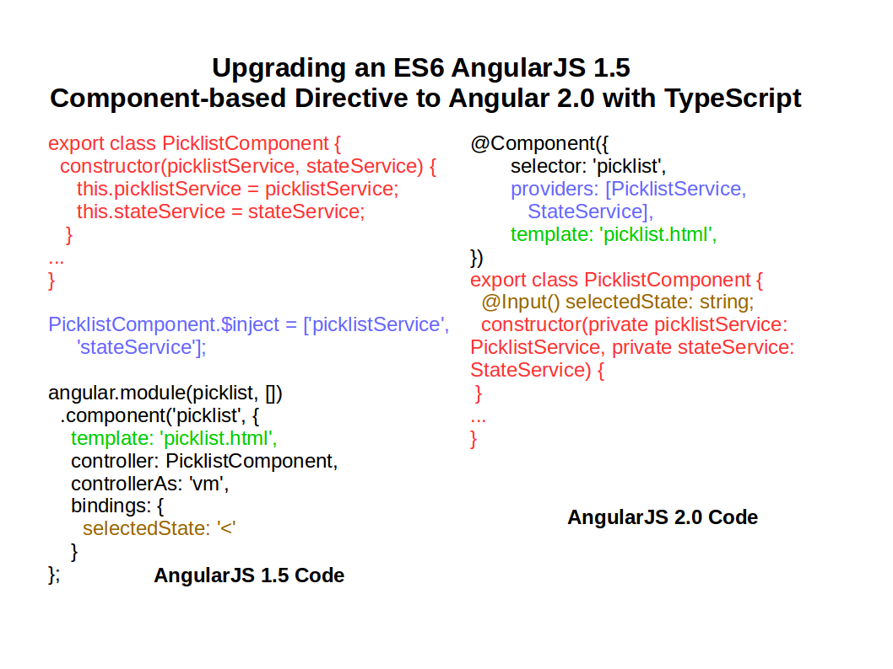
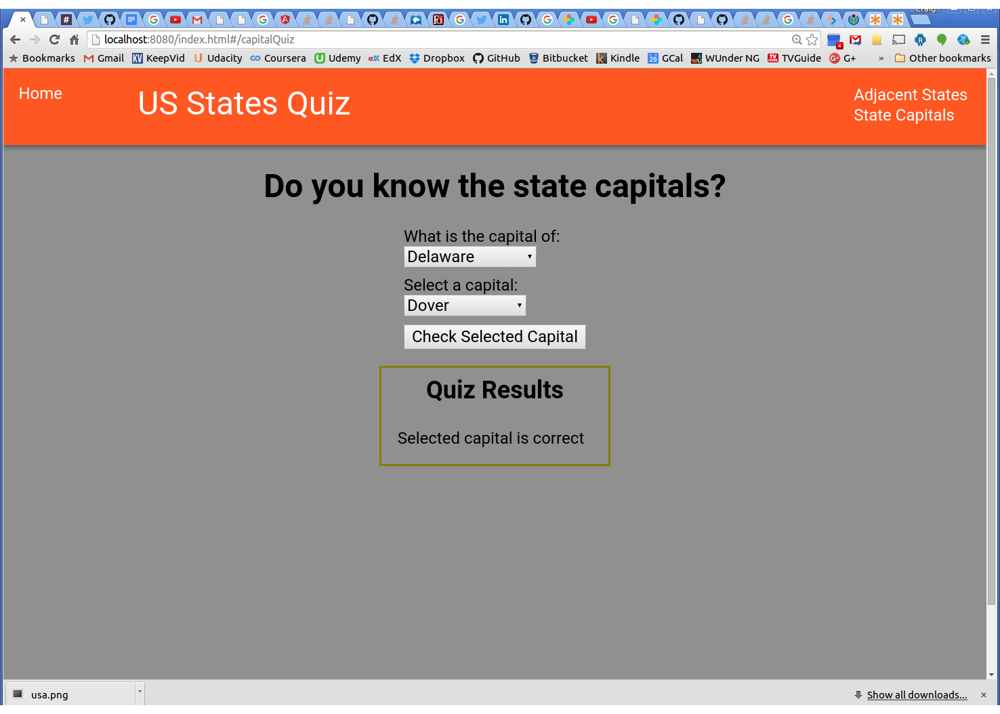

# state-geo: Test your knowledge of the US states #


**Note:** *This branch holds the Angular 1.5 version of this application. The Angular 2.0 version is under development in the [angular2.0 branch](https://github.com/cdoremus/state-geo-angular/tree/angular2.0 "Angular 2.0 Branch").*

The programming is done as an AngularJS 1 app using a component-based directive architecture similar to Angular 2.0 to make it easy to
upgrade to the new version. This is accomplished by following these guidelines:
* ES6/2015 is used throughout since Angular 2 is written in the new JavaScript version. Babel is used to transpile the code to ES5.
* AngularJS directives are created using the component() method instead of the directive() method.
* All of the directive's tag attribute values are locally scoped properties or event bindings of the directive's controller.
These attributes are also used in Angular 2 templates with their values bound to the Angular 2 component using @Input (for properties) or @Output (for events).
* Each directive's controller is implemented in a separate ES6/2015 class. They will become the Angular 2 component class when the app is upgraded.
* The AngularJS directive's controller uses the controllerAs property (or the default $ctrl) as the controller's alias.
This prevents use of $scope in the template since is not available in Angular 2. The AngularJS app does not use $scope elsewhere too.
* Replaced $watch() calls in AngularJS with RxJS Observable subscriptions since $watch is missing in Angular 2.
* AngularJS services are implemented as ES6/2015 classes. They will port directly to Angular 2.
* Standalone Angular controllers are NOT used in the app since they are dropped in Angular 2. Instead, the controller
code is encapsulated in a component directive that functions as a container.

An example of how to to upgrade a ES6/2015 AngularJS 1.5 component-based directive to Angular 2.0. Analogous code blocks are colored.


The build system for this application uses gulp with webpack (and babel). Stylus is used as the CSS preprocessor with Jeet to aid layout. If you want to run the program locally,
follow the following steps:

```bash
# clone this repo
git clone https://github.com/cdoremus/state-geo-angular.git

# change directory to the repo
cd state-geo-angular

# make sure you have the global npm packages installed
npm install -g gulp karma protractor

# install the repo's dependencues
npm install

# build the app
gulp

# start the server in a separate window
gulp serve
```
The application can then be accessed by browsing to <a href="http://localhost:4500/">http://localhost:4500/</a>.

Unit and end-to-end functional tests can be run using the following commands:

```bash
#Run unit tests run using Karma
npm tests

#Run end-to-end functional tests using Protractor
npm run e2e
```

The templates folder contains templates for new components built inside of a new folder under client/app. They can be created with this command:
gulp component --name newComponentName

This project builds a bundle.js that is put in a destination folder (dist). The application can also be configured to use a RESTful
Java web service and MongoDB (see state-geo-server-spring).

A running version of the application can be found at <a href="http://cdoremus.github.io/state-geo-quiz/" target="_blank">http://cdoremus.github.io/state-geo-quiz/</a>.

Screenshot of Adjacent States Quiz with Erroneous Results and Components outlined on the screen:


Screenshot of Adjacent States Quiz with Correct Results:


Screenshot of State Capitals Quiz with Correct Results:

