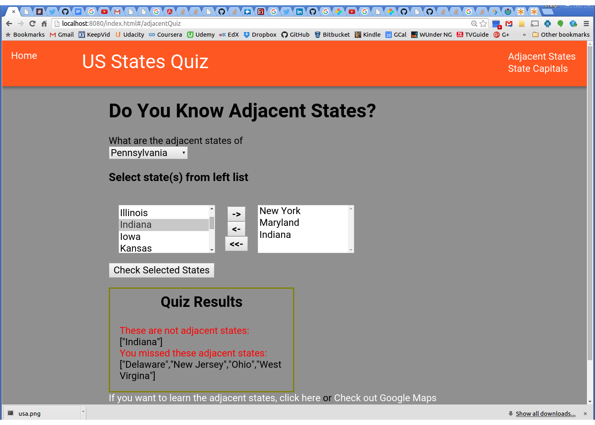
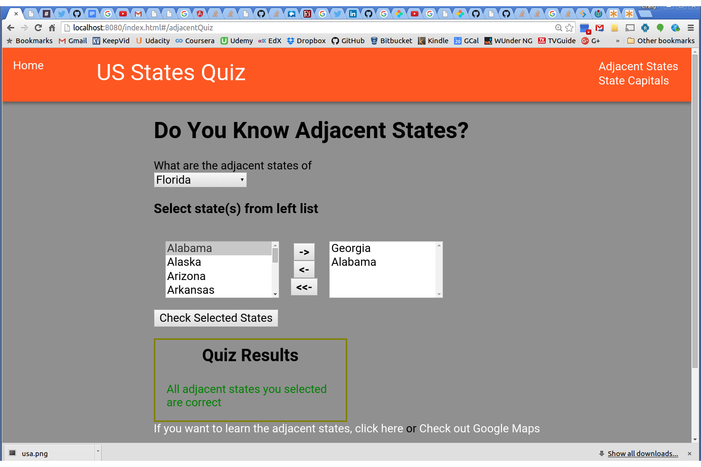

## state-geo: Test your knowledge of the US states.##

The programming is done as an AngularJS 1 app using a component architecture similar to what's coming in Angular 2.0 to make it easy to 
upgrade to the new version when it becomes available. This is accomplished by following these guidelines: 
* ES6/2015 is used throughout since Angular 2 will be written in the new JavaScript version. Babel is used to transpile the code to ES5.
* Isolated-scoped directives are used throughout since Angular 2 components will be isolated.
* Each directive's controller is implemented in a separate ES6/2015 class. They will become the Angular 2 component class when the app is upgraded.
* The directive's link function is not used since this function will not be available in Angular 2.
* The directive's DDO sets the controllerAs property since $scope is going away in Angular 2.
* Standalone Angular controllers are NOT used in the app since they are going away in Angular 2.
  
The build system uses gulp with webpack (and babel). Stylus is used as the CSS preprocessor.

The templates folder contains templates for new components built inside of a new folder under client/app. They can be created with this command:
gulp component --name newComponentName

This project builds a bundle.js that is put in a destination folder in the 
back-end server project that holds the Java web service and MongoDB repository code (state-geo-server-spring).

Screenshot of Adjacent States Quiz with Erroneous Results:

Screenshot of Adjacent States Quiz with Correct Results:

